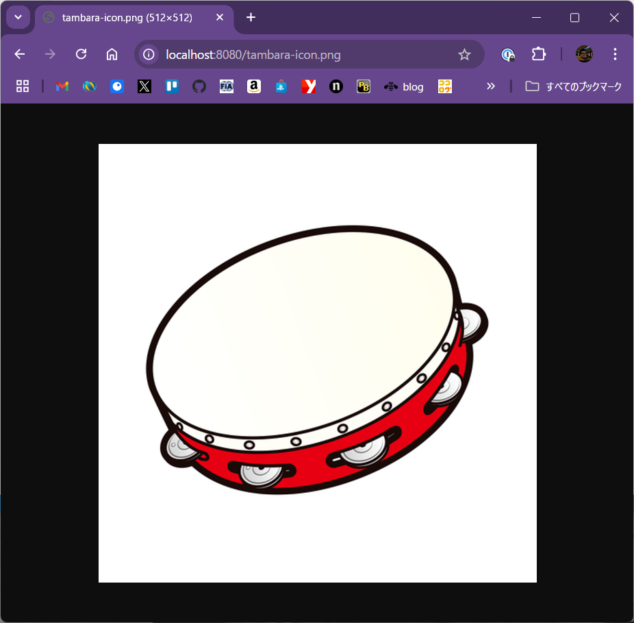
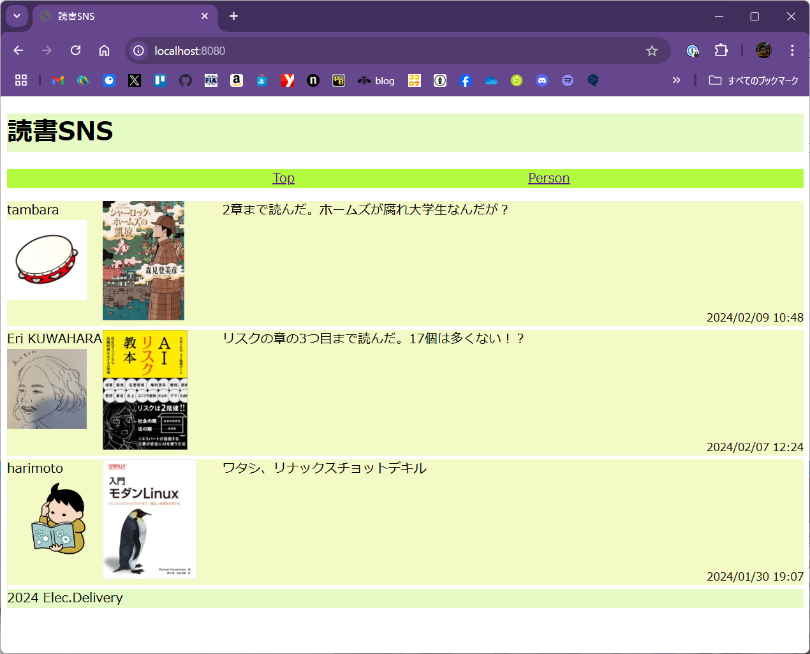
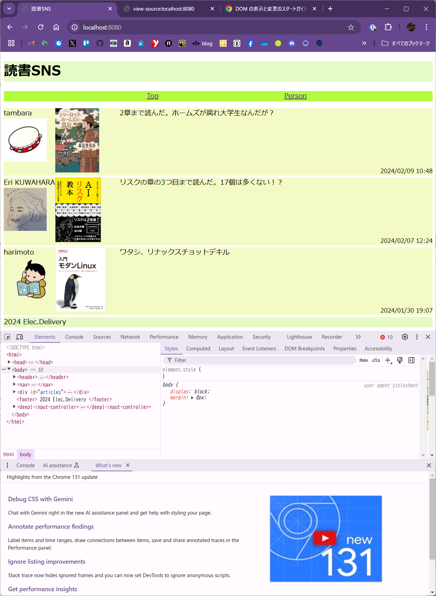
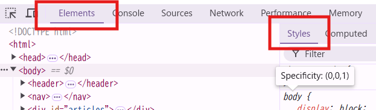
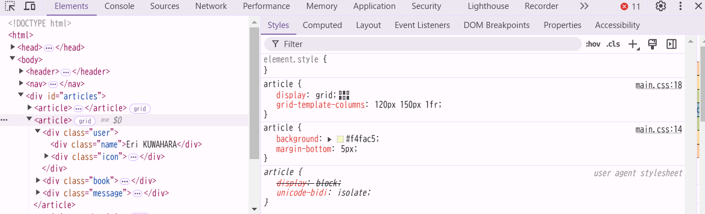
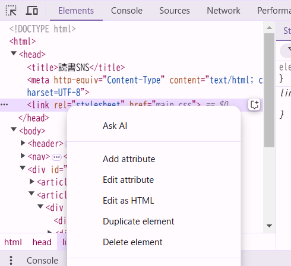
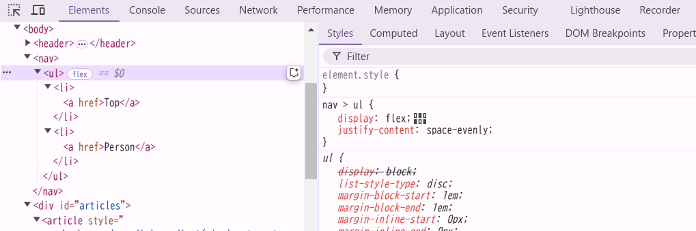
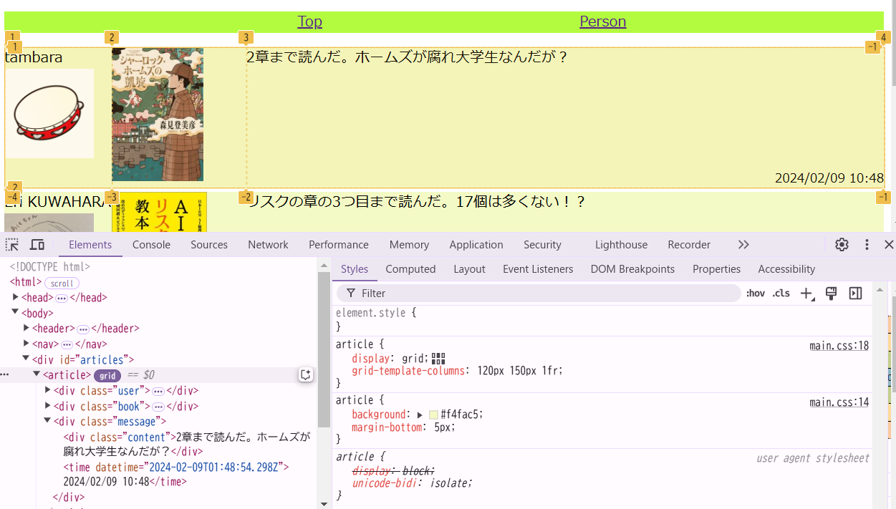
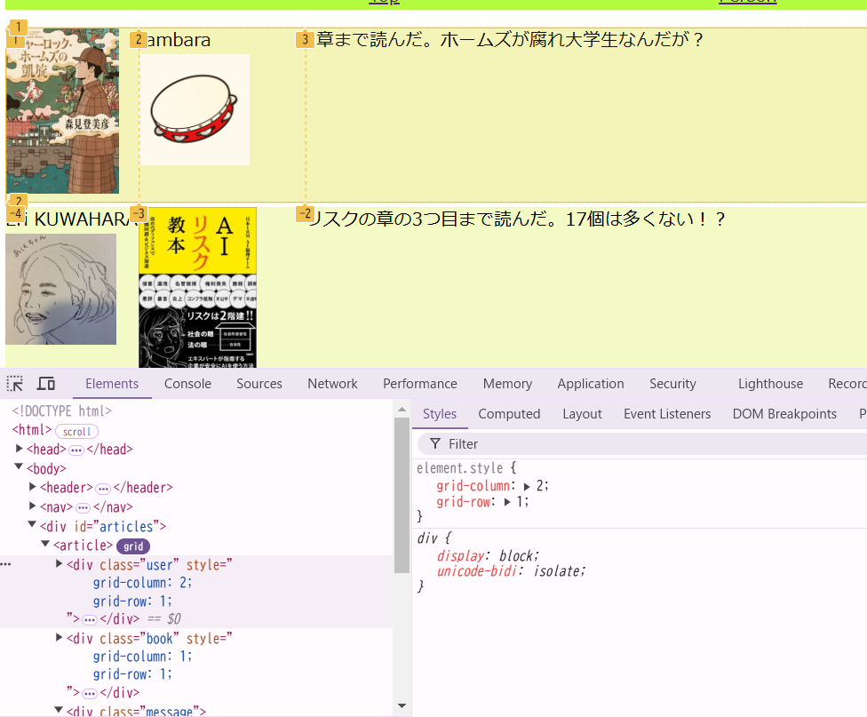

# ブラウザの開発者ツール

## 静的Webページの提供

さて、せっかくHTMLとCSSを学習したので、今回作っていくアプリのHTMLとCSSをここで見てもらおうと思います。

ファイルはGitHubのリポジトリにアップしました。リポジトリは https://github.com/tambara-ibm/tsjwa_2 です。
このリポジトリを見てください。

まず、tsjwa_1と変わっている点は、[/src/main/resources/static](https://github.com/tambara-ibm/tsjwa_2/tree/main/src/main/resources/static)にファイルが置いてあることです。ここに5つのファイルが置いてあります。

実はこのディレクトリにファイルを置くと、それはそのままWebで配信されます。
例えばここにtambara-icon.pngという私がSNSで使っているアイコンが置いてありますが、この状態で`gradle bootRun`でアプリケーションを起動して、
http://localhost:8080/tambara-icon.png にアクセスすると、画像ファイルを表示できます。



同じように、index.htmlも置いています。Webサーバではディレクトリにアクセスすると、そのディレクトリにあるindex.htmlを返すというルールがありますから、index.htmlは http://localhost:8080/ にアクセスすれば表示されるハズです。

ただし、今現在はHelloController.javaで`/`にアクセスしたらHello, worldと表示するようにしてあります。
なので、いったんそのメソッドをコメントアウトしましょう。それがtsjwa_1とのもうひとつの変更点です。

では、コメントアウトをして(やりかたはリポジトリの[HelloController.java](https://github.com/tambara-ibm/tsjwa_2/blob/main/src/main/java/one/tmbrms/readingsns/HelloController.java)を参考にしてください)、アクセスしてみましょう。



色彩のセンスがないのはちょっと勘弁してください。さて、前回までで学んだHTMLとCSSの知識でこの画面がどうやって作られているのか、想像がつくでしょうか。

## ブラウザの機能:ソースの表示

たぶん、難しいと思います。前回読んでもらった資料には書いてないことや、チョロッとしか書いてないをいろいろと使って作っています。
ズルいですね。

でも、HTML自体はそんなに難しい構造にはなっていません。
HTMLを見てみましょう。もちろん手元にあるindex.htmlファイルをエディタで表示してもいいんですが、
ブラウザの機能を使ってみます。というのも、今後、このHTMLをJavaプログラムで作るようになったら
(Webアプリを作っているんですから、当然、そうなるわけです)、生成されたHTMLがどうなっているか確かめるのには
ブラウザを使うのが便利だからです。

ここからの説明には、しばらくGoogle Chromeブラウザーを使用します。
様々な機能の説明をこれからしますが、まず間違いなくFirefoxだろうが、Safariだろうがどのブラウザを使っていても同様の機能はあります。
機能の名前がちょっとずつ違って戸惑うことはあるかも知れませんが、「こっちのブラウザにもあるはずだ」と思って
探したり、ググったり、AIに聞いたりすれば見つけられるはずです。

ではまず、おそらくは皆さんも一度はやったことがあるだろう、「ソースの表示」を試してみましょう。
Chromeブラウザの画面の上で右クリックしたメニューに「ページのソースの表示」があります。だいぶ下の方です。

それをクリックしてください。新しいページが開いて、HTMLが表示されます。

すごく複雑ではないですよね。階層もせいぜい5階層ぐらいまでしかありません。
ただ、`<nav>`だとか`<article>`だとか`<footer>`とか意味はなんとなく想像がつくけども知らないし、
何のためにあるのかもよくわからないタグが出てきます。
さらに、`<div>`タグもたくさん出てきます。こっちはたぶんCSSでこの場所を指定したいがために付けているんだろうというのは
わかるかもしれません。

画面のどこがHTMLのどこに対応するのかは文章を対応させればわかりますよね。

画面の上にあるTopとかPersonのようなメニューっぽい部分が実は`<ul>`タグ、つまり箇条書きで出来てるんだとか、
本の感想1つ分が`<article>`で囲まれていて、その中はuser, book, messageの3つの`<div>`タグで構成されているんだとか、
そういうことがなんとなくわかればOKです。

実は、`<nav>`や`<article>`、`<footer>`というタグは比較的最近追加されたものです。
そして、これらには決まったデザインが指定されていません。つまり、`<h1>`には囲んだら大きな文字になるという
あらかじめのデザインが決められていて、それをCSSで変更することが出来ますが、
`<article>`には何も決められていません。`<article>`で囲んでも何も変わらないのです。
じゃあ、何のためにこのタグがあるのか、不思議に思うかもしれません。

ニュースサイトやブログサイトなどには、だいたいナビゲートメニューや1つ1つの記事や画面の下のフッタースペースがあります。
これらを`<div class="article">`で囲んでCSSでデザインしてもよいのですが、どうせいつも出てくるのなら・・・ということで
作られたのがこれらのタグです。このように決められているタグはいくつかあるので、調べて使えそうなら使って下さい。
そうしておくと、例えばGoogleの検索エンジンなどのHTMLを読み込んでくれるプログラムや、
視覚障害者向けの読み上げプログラムが「ここが本文なんだな」とか「ここは画面遷移しても変わらない部分なんだな」のように
気を利かせてくれるかもしれないからです。

## ブラウザの機能:開発者ツール

では、具体的にどのようなCSSで画面が作られているのでしょうか。
それを見るためにはブラウザの開発者ツールを使います。
Chromeであれば、ブラウザの一番右上の3つの点が縦に並んだメニューから[その他のツール] - [デベロッパーツール]で起動出来ます。
また、画面の適当な要素を右クリックして出るメニューの一番下の辺りの[検証]を選んでもいいです。
画面の右、あるいは下になにやらとっつきにくそうな画面が出てきます。



とっつきにくさは、おそらくこのツールで出来ることがたくさんあることに依るのでしょう。いろんなことが出来ます。

このツールについては、特に標準規格などがあるわけでもないですから、各ブラウザのヘルプが1次情報になります。

Chromeブラウザであれば、ここでしょう。

* [Chrome DevTools](https://developer.chrome.com/docs/devtools?hl=ja)

ただ、このページはどこからどの順番で読めばいいのかが難しいですね。
今回のテーマについて言えば、パネルのところからこの2つを読めばいいと思います。

* [DOM](https://developer.chrome.com/docs/devtools/dom?hl=ja)
* [CSS](https://developer.chrome.com/docs/devtools/css?hl=ja)

しかし、まあ、とりあえずはガチャガチャいじってみましょうか。
今日使うところは一番上のメニューの一番左の[Elements]の、さらにその下のメニューの[Styles]だけです。
後のことは気にしないでください。



[Elements]の横に点線の四角と矢印の組み合わされたアイコンがありますね。これをクリックした上で、画面の知りたいところをクリックします。そうすると、ソースの対応する部分が選ばれ、その部分のCSSが表示されます。また、ソースの好きな部分を直接選んでもいいです。はい、どんどんガチャガチャ触って下さい。

例えば、1つの`<article>`を選んだ場合、こんな感じになります。



この部分に、どんなCSSが適用されているのかが表示されています。

main.cssと書いているのがstaticディレクトリに追加したファイルに書いてある内容です。user agent stylesheetと書いてあるのは、このブラウザが特に指定がなかったらデフォルトで適用するスタイルです。上書きされた内容には取り消し線がついてます。main.cssの上のところにはスタイルを書き足してやることが出来るようになっています。後で遊んでみましょう。

## スタイルを消してみる

まず、CSSファイルを指定しなかったらどうなるのかを試してみましょうか。スタイルシートを指定している`<link>`を消してやります。右クリックすると消すメニューがあるんですよ。[Delete element]を選んでやりましょう。



すると、画像の大きさもまちまちな、ただ要素が縦に並んだだけの背景真っ白の画面になりました。これが先ほどみたHTMLをただ素直にデフォルトのスタイルで表示したものです。

元に戻したい場合には、単にページをリロードして下さい。リロードで戻るのでいじりたい放題です。この後もわけがわからなくなったらリロードで戻れますから、気軽にいじりましょう。

## 通常フロー

スタイルシートを消してみるとわかるとおり、HTMLに書いた要素は基本的に上から下に並びます。

もう少しだけ正確に言うと、要素はインライン要素とブロック要素に分けられます。中に何か入れられそうなものはだいたいブロック要素で、自分を囲む上位の要素の幅いっぱいの大きさになり、縦に並びます。インライン要素、要するに行や文字のようなものはボックスの中に左から右(あなたがアラビア語のサイトを作っているなら逆になりますが)に並びます。

これを通常フローといいます。初期のWebでは特定の要素をこの並びのルールから除外させることは出来ました。例えば、新聞記事で写真を文章が回り込むようなレイアウトがありますね。ああいうことは出来ました。が、この通常フローのルール自体を変えることは出来ませんでした。なので、数少ないルールの例外措置を駆使して画面を作り出していましたが、ブラウザによってルールの解釈が微妙に異なり、レイアウトが崩れてしまうと言うようなことが、まま起こりました。

今でもこの技を駆使しているようなデザイン例を見かけることはあります。古い教科書や記事には注意が必要です。

## Flexbox

今や、このルール自体を変えることが出来ます。大きくやり方は2つありますが、そのうちの1つがFlexboxです。詳しくは前回読み飛ばしたCSSの説明を読んでもらえば良いのですが、簡単な例が今回のHTMLの画面上部の`<nav>`の部分です。ここのCSSを開発ツールで見ていきましょう。

あ、CSSを消しちゃってたら、一度、画面をリロードしておいてください。では、「Top」と「Person」が選べそうな(今はクリックしても何も起きません)メニュー部分の要素を開発者ツールで見てみましょう。



`<ul>`要素のところに[flex]とマークがついていて、CSSでは`display: flex`が指定されています。これがこの中は通常フローではなくFlexboxのルールに従うよという印です。試しに、`display: flex;`と記述されているところにマウスカーソルを持っていって見てください。チェックボックスが表示されます。これを外してみてください。2つの`<li>`が縦に並びました。これがFlexboxです。Flexboxでは、ブロック要素を1次元にずっと並べることが出来ます。画面の右端まで行ったらそのままスクロールバーを出すのか、折り返すのか、選べます。ブログサイトなどでカード型の記事がたくさん並んでいるようなレイアウトを見かけますが、それはこのような形で作られていることが多いです。

## Grid

通常フローに変わる新しいルールのもうひとつがGridです。`<article>`のところを見てみましょう。ここには[grid]というマークがついていると思います。これをクリックして見ましょう。



画面に枠が表示されたと思います。

CSSのところも見てみましょう

```css
article {
    display: grid;
    grid-template-columns: 120px 150px 1fr;
}
```

`display: grid;`で通常フローからGridにルールを変えたことが宣言されています。その下の`grid-template-columns`で

* 3列の枠を作り
* 1列目が120px, 2列目が150px, 最後の列はのこり全部

であるような枠、つまりグリッドを作るように指示されてます。それが画面上に出た枠です。

これで、`<article>`の要素は枠に順番に配置されるようになります。

ただし、どの枠に入れるかも指定が出来ます。



このように、開発者ツールで直にCSSを書き加えることができます。`<div class="user">`の部分に`grid-column`と`grid-row`で何行何列目に入れたいのかを直に指定しているようすがわかります。userとbookの部分に指定をして、書影とユーザーをCSSだけで入れ換えることが簡単にできます。

Gridは画面を枠に分けて、好きな要素を好きな枠に入れられる非常に便利な機能です。Flexboxより後に出来たのでFlexboxよりもまだ知られていませんが、GUIの開発という目的には非常に便利です。積極的に使って慣れていってください。

