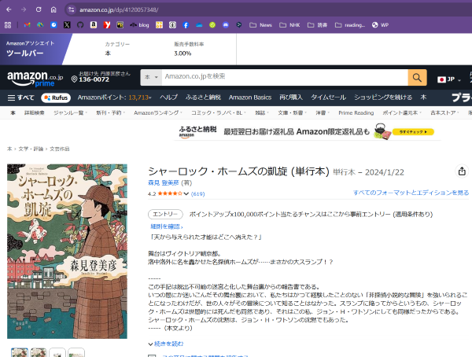
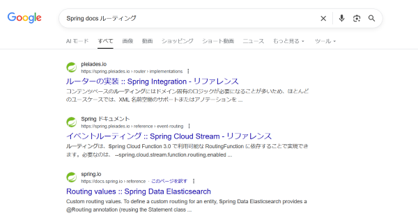

# パスとパラメータ

## URL

URLという言葉は聞いたことがあるでしょう。Uniform Resource Locatorの略です。
意味は、「決まった形で表したリソースの場所」。
一般にWebサイトのアドレスのことだと思われてますが、見たいHTMLファイルが
どこにあるのか決まった形式で表したものってことです。場所を示してるんだから、まあ、アドレスでも間違いではないね。

しかし、インターネットが普及して、いろいろなものをやりとりするようになると
URLの形式で表現するものが「場所」なのかは微妙じゃない？とみんなが思い始めました。
URLは場所じゃなくて、そのリソースそのものを指してるんだと考えた方が自然だろうと。
というわけで、URLじゃなくてURI(Uniform Resource Identfiers)と呼ぼうということになりました。
なので、URIが正式ですけど、正直、URLよりマイナーで、イマイチ普及してる感じはありません。
皆さんとしては、例えば何かのツールのヘルプとかマニュアルとかで「URL」で検索しても何にも引っかからないときは
「URI」も検索してみたらいいぐらいの認識でいいと思います。

さて、このURIがどういう構造になっているかですが、みんな曖昧にしかわかってないことでしょう。
でも、我々はプロなのでちゃんと学びましょう。

URIは
* スキーム(Scheme)
* オーソリティ(Authority)
* パス(Path)
* クエリ(Query)
* フラグメント(Fragment)

からなります。それぞれが何かは、MDNを読んできましょう。この手のことを知りたいときは、MDNが確実です。
「[開発者向けのWeb技術](https://developer.mozilla.org/ja/docs/Web)」の
「[URI](https://developer.mozilla.org/ja/docs/Web/URI)」を読んできて下さい。

## パスとクエリとパラメータ

URL(この後、URLをURIと同じ意味で使います)を学んだところで、今、私たちが注目すべきなのは、パスとクエリです。

これまでの知識で、あるURLにアクセスしたときに何らかのルールで
それがコントローラーに定義した1つのメソッドが呼び出されるということまで理解しました。
この「どのメソッドを呼び出すか」のルールのことを、Webフレームワーク一般の言葉で「ルーティング」といいます。
これはだいたいどのフレームワークも同じです。だから、例えばPHP言語のLaravelというフレームワークでは、
どういう仕組みでルーティングを設定するのかなと思えば、「Laravel docs routing」でググれます。
[Laravelの公式ドキュメントのRoutingのページ](https://laravel.com/docs/12.x/routing)が見つかるはずです。

しかし、私たちが知りたいのはSpring Frameworkのこと。
でも、一番簡単なルーティングの設定の例はすでに前節でも見ましたね

```java
@GetMapping("/greeting")
public String greeting() {
  (以下略)
```

この様に、@から始まるアノテーションという構文を使ってルーティングを設定することが出来ました。

しかし、素朴な疑問が沸きますね。呼び出しているのはメソッドです。そして、メソッドは普通、引数を取って、
その引数によりいろいろな値を返すものです。毎回同じものを返すのであれば、静的ページでいいよね？

ついさっき教わったとおり、URLにはクエリというものがありました。クエリに設定したものをルーティング先のメソッドに
渡してやる方法が、きっとあるはずです。

また、クエリしかパラメータにならないわけはありません。例えば、Amazonで1冊の本を表すURLはこんな感じです。

* `https://www.amazon.co.jp/dp/4120057348`

このURLにアクセスすると、このページが出ます。



このURLの数字の部分はどうみてもISBNですよね。ここがパラメータになっているはずです。このサイトをSpringで実装するときに、まさか

```java
@GetMapping("/dp/4120057348")
public String book4120057348() {
  (以下略)
```

になってるはずはありません。ISBN部分をメソッドの引数に入れるやり方がきっとあるはずです。

お待たせしました。ここまでで知りたいことが整理されましたから、答えを見つけに行きましょう。
さっきLaravelで試したことを、Springで試してみる時です。



・・・そんな馬鹿な。この一番上のヤツはSpring IntegrationというWebフレームワークじゃない別のソフトウェアです。
2つ目はその日本語版。3つ目はSpring Data Elasticsearchというこれまた別のソフトウェアの話です。

あなたがきっと知らないElixirという言語の、あなたがきっと知らないPhoenixというWebフレームワークですら
「elixir phoenix docs routing」でググれば、[Routing](https://hexdocs.pm/phoenix/routing.html)という
ページが見つかるのに。絶望しかない。

残念ながら、Spring Frameworkはルーティングに関して他のフレームワークと違う言葉を使っています。
前節の例でも`@GetMapping`というアノテーションを使っていたことからも推測出来るかもしれません。
Spring Frameworkでは「Mapping Requests」と呼びます。これでググれば見つかります。
日本語版もすぐ見つかると思います。

[リクエストマッピング](https://spring.pleiades.io/spring-framework/reference/web/webmvc/mvc-controller/ann-requestmapping.html)

しかし、このドキュメントの、このページ以外の部分はひたすら複雑なことが書いてあるので、ひとまずはこのページだけ、
それも「URIパターン」の部分をしっかり読んで下さい。あとは流し読みでOK。

さらにもう1ページ、目次の「リクエストマッピング」の下、「処理メソッド」の下の「[@RequestParam](https://spring.pleiades.io/spring-framework/reference/web/webmvc/mvc-controller/ann-methods/requestparam.html)も流し読みしてください。

ポイントは、パスの一部とクエリをどうやってメソッドに渡すのか、その方法が掴めればOKです。
こうやって知りたいことの検討を付けて、公式ドキュメントを拾い読むのもSpring Frameworkのような巨大なソフトウェアを使うときに必要になるコツです。

## サンプル

では、実際に試してみましょう。まずは、/user/tambaraにアクセスしたら、userメソッドに引数としてtambaraが渡るようにしてみましょう。
こんな感じになります。

```java
 @GetMapping("/user/{id}")
 public String user(Model model, @PathVariable int id){
    (以下略)
```

もちろんPathはStringですが、こうやってintを指定すると型変換してくれます。では、数字じゃないパスにアクセスしたらどうなるかは試してみてください。

もうひとつ、/usersでユーザーの一覧が得られ、その並び順を/users?order=descで逆順にできるようにしたいというようにクエリパラメータを使いたい場合はこうです。

```java
 @GetMapping("/users")
 public String users(Model model, @RequestParam("order") String order){
    (以下略)
```

他にいろいろなことをしたくなるかもしれません。きっと出来ると思いますので、ググったりAIに質問したりして見当をつけて、
このドキュメントから使い方を見つけてください。
