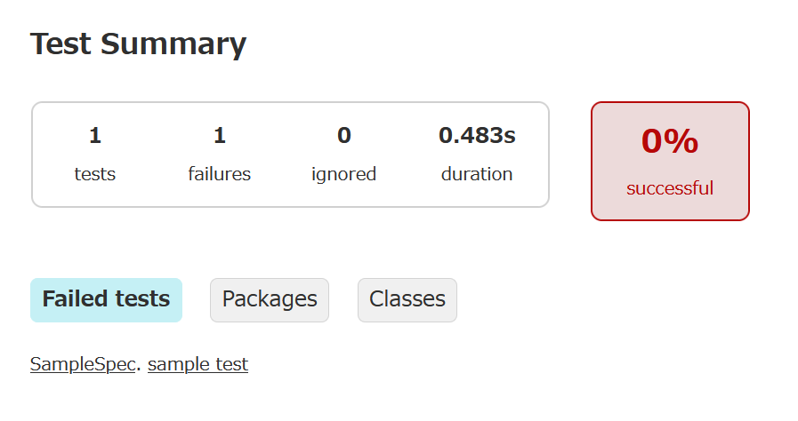

# 単体テストの自動化

## 単体テストとは何か

タイトルにJavaと書いておきながら、ここまであんまりJavaのコードを書くことがありませんでしたが、[テキストファイルの読み書き](textfile.html)あたりからやっとJavaプログラミングらしくなってきました。

あまりプログラミングをしたことがない方は、プログラマは一気に何十行ものコードをばりばりと打ち込んでいるようなイメージを持っているかもしれません。[実際にそういう方もいらっしゃる](https://softether.hatenadiary.org/entry/20070324/p1)のですが、こういう方は特殊であり、普通はちょっと書いては動かして確認をし、思った通りに動作していることが確認できてはじめて続きを書いていきます。1行書いて実行・・・どころか、1行書く間に何度も実行することもあるでしょう。

そのような動作の確認をしているときに、いちいちアプリケーション全体を起動していては大変です。なにしろ今私たちが作ろうとしているのはWebアプリケーションですから、起動するとWebサーバが立ち上がります。動作を確認するにはブラウザが必要です。けっこう面倒くさいですよね。ブラウザを立ち上げると、ついうっかり関係ないサイトを見てしまったりしますし。それは私だけか。ともあれ、今作っている部分だけを動かして、そこだけの動きを確認したいと考えるのは自然だと思います。

さて、プログラムの一部だけ動かしたいと考えたとして、それはどこからどこまででしょう。その範囲が決められないと困ります。素直な発想として、その単位は特定のメソッドだと考えていいでしょう。しかし、Javaのメソッドは必ずどれかのクラスに属しています。そして、Staticなメソッドではない普通のメソッド(インスタンスメソッド)は、クラスをインスタンス化、つまりnewしてやらないと実行出来ません。

そこで、単体テストとはこのようなものだということが出来ます。アプリケーションの中の特定のクラスを通常のアプリケーションの流れとは別に、それだけをいきなりインスタンス化して、そのインスタンスのメソッドを動作させ、動きを確認する。そういうやりかたです。アプリケーション全体を動かす必要がないのでラクチンです。

## テストしやすい構造

ということは、テストをするためには

* 単独でインスタンス化でき
* 単独で意味のあるメソッド

であることが必要です。そんなの当たり前じゃないかと思われるかもしれませんが、インスタンス化したら初期化プロセスでネットワーク先のサービスにアクセスに行ったり、メソッドを実行したら別の様々なクラスを呼び出したりするのはいただけません。テストの準備が大変になったり、あちこちに処理が飛んで結局何をテストしたかったのかわからなくなったりします。

これは実際にテストを作っていけばわかりますが、できるだけ他のものに依存しない構造が必要です。ある入力をパラメータで渡したら、決まった出力が出てくるようなメソッドはテストがしやすいです。そのようにテストしやすいものを組み合わせていくと、アプリケーション全体の構造もわかりやすくなる傾向にあります。しかし、実際にテストを書いてみないとよくイメージ出来ませんよね。とりあえず、試してみたい部分を上手く1つのクラスの1つのメソッドに入れられたとして、話を進めましょう。

## テストフレームワーク

さて、テストしたい対象がうまく分離できたとして、これをどうやって動作させればよいのでしょうか。それにはテストプログラムという別のアプリケーションを作ることになります。そのテストプログラムの中から、テストしたい部分を呼び出すわけです。つまり、「単体テストをする」ということは「テストしてくれる別のアプリケーションを作る」ということを意味します。そう聞くと、ちょっと腰が引けるかもしれません。出来るかなあと思ってしまいますね。

しかし、別のアプリケーションと言っても、単にテストしたいアプリの一部を取り出して実行するだけなので構える必要はありませんし、それを簡単につくるためのフレームワークも準備されています。一般にテストフレームワークと呼ばれます。イマドキのプログラミング言語だと言語の組み込みの機能としてテストフレームワークを持っていたりするのですが、Javaは歴史ある言語なのでそうではありません。むしろ、テストフレームワークという技術自体が生まれたときに真っ先に作られたのがJava用のテストフレームワークでした。さすが、メジャーな言語です。そして、その歴史的に有名なテストフレームワークがJUnitです。由緒正しいのです。名前は聞いたことがあると思います。

しかし、今回はあえて別のフレームワークを採用します。JUnitは非常に有名なフレームワークなので、ぜひ、一度触ってみて欲しいのですが、今回採用するのはちょっとマイナーなフレームワーク、Spockです

## Spock

テストフレームワークには、最初に作られた系譜であるxUnit系と後に現れたxSpec系の大きな2種類のグループがあるのですが、名前から推測できる通りSpockはxSpec系のフレームワークです(スペックとスポック、似てますよね）。xSpecはBDDスタイルという書き方をするんですが、ここではJUnitとは書き方のお作法が違うよということだけ覚えておいてください。xUnit系を1つ、xSpec系を1つ触ったことがあれば、どんなプログラム言語のテストを書くときも戸惑わずに済むと思います。今回は、xSpec系に触ってみましょう。

もうひとつ、非常に大きな特徴がプログラムをGroovyというJavaとは別の言語で記述するということです。GroovyはJavaと同じくJVMの上で動くプログラムを作るための言語で、名前から推測出来るとおりスクリプト言語のRubyに影響を受けています（グルービーとルビー、似てますよね）。GroovyはJavaと一緒に使うことを重視している言語で、要は「くだけた表現で書いても良いお気楽なJavaの方言」だと思ってもらってOKです。

* 変数に型が無い
* 手軽にリストを作れるし、使える
* 比較に`equals`じゃなくて`==`を使う
* 高階関数とラムダ式をシンプルに記述出来る
* 組み込みの`assert`がある
* private と publicの区別がない

など、テストプログラムを簡潔に書くのに非常に向いた性格を持っています。

「テストを書くために新しい言語を1つ覚えるのは面倒だなあ」と思われるかもしれませんが、まあ、そう言わずに試してみてください。「上手い具合にJavaをサボって書けるようにしてあるんだなあ」と感心すると思います。

### Spockのドキュメント

さて、まず最初に読むべきドキュメントですが、Groovyのチュートリアルを日本語に訳してくれている人がいます。だいぶバージョンが古いのですが、Groovyの基礎を知る上ではこれで十分です。

* https://koji-k.github.io/groovy-tutorial/if/index.html

このドキュメントの以下の章を読んで下さい

* 4章 変数
* 5章 if文
* 6章 リスト
* 7章 クロージャー
* 8章 マップ
* 13章 ユニットテスト

13章はSpockの説明なので、これだけ読むとひとまずGroovyも書けてSpockも使えるようになります。

上の6章のリストの説明でも紹介されていますが、GroovyではJavaのクラスにGroovy用のメソッドが追加されています。
どのようなものがあるのかは、[Groovyの公式ドキュメント](https://www.groovy-lang.org/documentation.html)の
[The Groovy Development Kit](https://www.groovy-lang.org/groovy-dev-kit.html)で
紹介されています。このページは何度も見ることになるでしょう。

[Spockの公式ドキュメント](https://spockframework.org/spock/docs/2.3/index.html)もざっと読めれば良いのですが、英語ですし、書いている途中でより知りたいと思ったときに
拾い読みすれば十分です。時間があるなら、[3章 Spock Primer](https://spockframework.org/spock/docs/2.3/spock_primer.html)だけを
通して読んで下さい。

### Spockのセットアップ

では、Spockを使うためのセットアップです。

といっても、いつものようにbuild.gradleに追加の設定を書けばダウンロードして、使えるようにGradleがしてくれます。
もうおなじみですね。

と、言いたいところですが、実情はなかなかに複雑です。私も正確に理解出来ているとは言いがたいのです。

まず、Spring Bootはテストのためのstarterを用意しています。`spring-boot-starter-test`です。starterというのは、Spring Bootで用意されているツールで、実際のソースコードで何をimportしているかなどの情報を元に適切なライブラリをいい感じに取ってきてくれるツールです。JUnitでテストをするのならこれだけ設定すればいい・・・といいたいところですが、 現状、JUnitはバージョン4と5が併用されていて、その2つは構造が大きく変わっているためにどちらを使うにも多少、注意が必要のようです。詳しくは[リファレンスのテストの部分](https://spring.pleiades.io/spring-boot/reference/testing/)を確認してください。では、starterを設定しましょう。build.gradleのdependenciesに以下の行を追加します

```
testImplementation 'org.springframework.boot:spring-boot-starter-test'
```

これで、JUnitは使えるようになります。Spockでは記述したテストを実行する部分はJUnitの機能を流用します。そうしておくと、世の中のJUnit用のツールが使いやすくなるためです。そのために、まずはJUnitが使えるようにしておきたいのです。この1行で、`gradle test`コマンドによるテスト実行は可能です

さらに、Visual Studio CodeなどのIDEでJUnitを使うための機能も追加します。build.gradleのdependenciesに

```
testRuntimeOnly 'org.junit.platform:junit-platform-launcher'
```

を追加し、さらにbuild.gradleの最後に以下を追加しておきます。

```
tasks.named('test') {
	useJUnitPlatform()
}
```

次に、Spockのための設定を追加します。詳細は、[「Setting up and Using Spock With Gradle」](https://www.baeldung.com/groovy-spock-gradle-setup)を参照して下さい。

まずはgroovyのpluginを入れます。これにより、gradleはgroovyのソースコードはどこに格納されて、コンパイルはどういうコマンドでやれば良いかなどをまとめて理解します。pluginsに

```
id 'groovy'
```

を追加してください。

次に、dependencyです。以下の2つを追加してください。

```
testImplementation 'org.spockframework:spock-core:2.4-M6-groovy-4.0'
testImplementation 'org.spockframework:spock-spring:2.4-M6-groovy-4.0'
```

spock-springを指定すればspock-coreも連れてきてくれるような気がするんですが、参考にした資料がこうなっているので、2行書いておきました。注意が必要なのはSpockのバージョンです。Spockの最新のリリースバージョンは2.3なのですが、2.3は2022のリリースで、最新のSpringにもGroovyにも対応していません。なので、2.4の最新のプレ・リリース版である2.4-M6を使います。もう3年もプレリリース状態で、定期的に更新されているので利用に心配はいらないのですが、どうしてリリースされないのかは私もよくわかりません。

これでOK。では動作確認を兼ねて、サンプルを作っていきましょう。

## サンプル

### 動作確認

では、まずは動作確認のための最も簡単なものを作ります。

まず、ファイルの位置ですが、プロジェクトのトップレベルにsrcディレクトリがあります。この下に、mainとtestがあり、コレまではmainディレクトリの下にjavaディレクトリがあり、その下にpackageと同じ構造のディレクトリがあって、クラスはパッケージと一致する位置に作ってきたと思います。

今回はここまで使ってこなかったtestディレクトリの出番です。例えば、プロジェクトのパッケージ名がcom.example.readingsnsだったとすると、例えばReadingsnsApplicaiton.javaは

* src/
  * main/
    * java/
      * com/
        * example/
          * readingsns/
            * ReadingsnsApplication.java

にありました。

今から、SampleSpec.groovyというファイルを作りますが、場所は

* src/
  * **test**/
    * **groovy**/
      * com/
        * example/
          * readingsns/
            * SampleSpec.groovy

に作ります。ルールは簡単ですね。

では、SampleSpec.groovyの中身です

```groovy
package com.example.readingsns

import spock.lang.*

class SampleSpec extends Specification {

    def "sample test"() {
        expect:
        2 + 3 == 6
    }
}
```

packageはファイルの場所と一致させて下さい。ちなみに、mainにあろうがtestにあろうが、パッケージは共通です。基本的にテストしたいクラスと同じパッケージにしましょう。そうすると、テスト対象クラスをimportする手間が省けます。

spock.lang.* をimportするのはお約束です。

クラス名は「テストしたいクラス+Spec」にするのがルールです。今回はテストしたいクラスがないので、適当です。

テストクラスは、spock.lang.Specificationをextendsして作ります。

テストはメソッドに記述します。テストメソッドの名前はテストケース名をそのまま書きます。ちょっとキモチワルイですが、呼び出すプログラムを書くわけではないので、このほうがわかりやすいのです。ちなみに、普通のJavaプログラムでも、日本語のメソッド名を付けることはできます。

テストメソッドの中には、通常であれば3つのブロックを書きます

* given:
  * テストの条件を整える
* when:
  * テスト対象を動かす
* then:
  * 結果を確認する 

ですが、今回は別に何もテストしない、テストの動作を確認するだけなので、expect: という結果だけ確認するブロックを使っています。

JUnitだと、テストの中で検証したい部分にはassertメソッドを使いますが、Spockではthen: あるいは expect: の下に書いた式はすべてtrueであることがチェックされます。なので、ただ `==`で比較する式だけを書いておけばOKです。

ちなみに、失敗させてみたいので、わざと計算結果は間違えてあります。

では、テストを実行してみましょう。`gradle test`を実行するか、IDEの機能を使って実行してください。

```
1 test completed, 1 failed
```

という素っ気ないログが出てきます。その下に

```
1 test completed, 1 failed

FAILURE: Build failed with an exception.

* What went wrong:
Execution failed for task ':test'.
> There were failing tests. See the report at: (index.html ファイルの場所)
```

詳しいことはここを見ろとのことなので見てみましょう。この場所は、プロジェクトのディレクトリの中のbuild/reports/tests/test/index.htmlになっているはずです。



見やすいですね。"sample test"を選択すると

```
Condition not satisfied:

2 + 3 == 6
  |   |
  5   false

	at one.tmbrms.readingsns.SampleSpec.sample test(SampleSpec.groovy:9)
```

というようなログが出ています。9行目で左辺が5なのに右辺が6ですよ・・・というような説明です。親切ですね。テスト結果の説明が親切なのも、Spockの良いところです。

### Spring Bootのコンポーネントのテスト

単体テストはこのようにプログラムのある部分だけを動かして機能をテストする技法ですが、Spring Bootを使ったアプリケーションの場合、考えるべきことが追加されます。

ここでいささか唐突ですが、DIについておさらいします。DI、すなわちDependency Injection(依存性注入)とは、プログラムの実行時に動的に設定や動きを変えるための仕組みです。例えば、テスト環境と本番環境では使うデータベースソフトウェアが違うので呼び出しに使うオブジェクトも違うとしましょう。でも、プログラムは全く同じで、呼び出しに使うライブラリが実行環境にある設定ファイルや環境変数により上手く差し替えられるようにする仕組みのことです。

DI自体は特にプログラミング言語や実行環境に依らない概念ですが、実のところ、JavaによるWeb開発以外でそれほど使われていません。というのも、JavaによるWeb開発ではJakartaEEという規格があり、その規格で動くアプリケーションサーバ(TomcatやWebSphereなど)、アプリケーションサーバで動くWebアプリケーションが分かれています。そして、JakartaEEの中にCDIというDIで実行中のオブジェクトを差し替えてしまう規格もあり、これを使ってDIが簡単に行えるのです。逆に他の言語では他の仕組みのほうがメジャーなので、DIはあまり使われません。

しかし、単体テストをするときにはこの仕組みは邪魔になります。アプリケーション全体を起動することなく単独のクラスをインスタンス化したいけど、そのクラスの中のメソッドの中で使うオブジェクトがDIで注入されなければ動かないとしたら、そのコードは正しく動作しません。テストが出来ません。

その場合はDIされる部分と、テストしたいロジック部分を上手く分離させる工夫が必要になります。それは単体テストを上手く書く上でのテクニックです。一般に、アプリ機能を実現するプログラムコードを書くよりも単体テストのコードを書く方が高度なテクニックを必要とすることが多いです。高度なテクニックといっても、それはプログラムコードを整理して保守しやすくする基本的なテクニックであり、それを身につけることでアプリ機能のプログラムコードも確実に良いものに出来ます。プログラミングスキル向上のためにも、ぜひ、単体テストは身につけて欲しいです。

とはいうものの、DIされるコードが含まれていると単体テストできないというのは不便ではあります。DI部分はJakartaEE規格のアプリケーションサーバ(これをJakartaEEコンテナといいます)がないと動作しないのですが、Spring BootはSpringフレームワークで作ったアプリケーションにライブラリとしてTomcatというJakartaEEコンテナをくっつけてしまったものですから、アプリケーションコードのなかにJakartaEEコンテナは持っています。これを使ってDI部分を動かしてテストできても良さそうなものです。

というわけで、できます。今回のアプリケーションはDBアクセス部分でDIの機能を使っちゃってるので、DBにアクセスするコードをテストする例でやり方を説明しましょう。ただし、このようなテストを推奨するわけではありません。実際のDBを使ったテストはDIのためにJakartaEEコンテナを起動する時間もかかりますし、DBへのアクセスはJavaプログラムだけのテストに比べて遅いし不確実になりがちです。さらに、DBを使ったテストは並行性にも問題があります。複数のテストが1つのテーブルにアクセスしてテストをすると人が使っているデータを誤って消してしまうなどの競合が起きるため、テストをシーケンシャルに実行する必要があります。これもテスト実行時間を遅くする原因になります。けして推奨されるやり方ではないので、必要に応じて賢く組み入れてください。

では、DIコンテナを含む場合はこんな感じです。

```java
package one.tmbrms.readingsns.repository

import spock.lang.*
import org.springframework.boot.test.autoconfigure.orm.jpa.DataJpaTest
import org.springframework.boot.test.autoconfigure.jdbc.AutoConfigureTestDatabase
import org.springframework.boot.test.context.SpringBootTest.WebEnvironment
import org.springframework.beans.factory.annotation.Autowired
import one.tmbrms.readingsns.entity.Book
import one.tmbrms.readingsns.repository.BookRepository

@DataJpaTest
@AutoConfigureTestDatabase(replace = AutoConfigureTestDatabase.Replace.NONE)
class BookSpec extends Specification {
    @Autowired
    BookRepository bookRepository

    def "test book creation"() {
        given: "a new book"
        def books = bookRepository.findAll()

        expect: 
        books.collect{it.name}.sort().first() == "AIリスク教本　攻めのディフェンスで危機回避＆ビジネス加速"
    }
}
```

以前の説明で、`@Controler`などの特定のアノテーションを付けたクラスでしか`@Autowired`を使ったDIは動作しないよと説明しました。テストでもそれは変わらず、今回のようなJPAを使ったDBアクセスのテストであれば`@DataJpaTest`を使います。これを使った場合にはWebサーバなどDBのテストに不要なJakartaEEコンテナの機能は起動しないので、いくらかは動作が速くなります。それでもやはり遅いのは遅いのでほどほどで使いましょう。`@DataJpaTest`の使い方や設定については、[@DataJpaTest and Repository Class in JUnit
](https://www.baeldung.com/junit-datajpatest-repository) が一次資料です。詳しくはそちらを確認してください。

また、上の例ではすでにDBにデータが入っている状態でアクセスする例になっていますが、本来でいえば、テスト開始前に使うテーブルの中身をいったんすべて消し(Trancateし)、テストに必要なデータをセットしなおす方が良いです。何度もテストをしたり、テストがエラーで途中で止まってしまったりするとテーブルの中にはゴミが溜まっていることがあります。安定したテストのためには`setup`という名前のメソッドを作り、そこでテーブルの準備をします。`setpu`という名前のメソッドがあると、テスト実行の前に必ず実行されます。

また、テーブルにテストに必要なデータをセットするときには別に用意したCSVファイルをロードするのではなく、テストコード中にデータも書き込んでしまうべきです。以下は私の書いたQiita記事ですが、参考にして下さい。

[テストデータ？ CSV形式でテストコードに埋め込んでしまえ(Qiita)](https://qiita.com/tambara/items/b5bb0cd70a4c4c004453)
