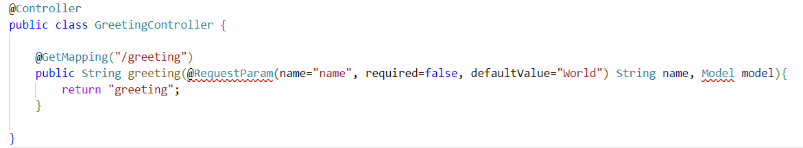
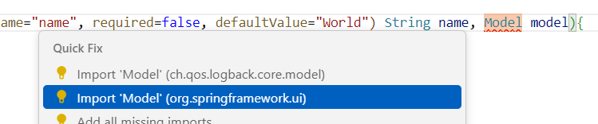

# テンプレートエンジン

## テンプレートエンジンとは

ブラウザからアクセスされたときに好きなHTMLを返すには

```java
@GetMapping("/greeting")
public String greeting() {
    String html = """
        <html>
            <body>
                <h1>Hello, world!</h1>
            </body>
        </html>        
    """;
	return html;
}
```

このように単純にHTMLを文字列としてプログラムから返してやれば良いことはすでに学習しました。

しかし、ここにHTMLを書いてしまっては、Javaのコードの大部分がHTMLになってしまい、読みづらくなってしまいます。
当然考えるのは、「HTMLは別のファイルに書いておいてそれを読み込んで、必要な部分だけを書き換えて出力すればよいのではないか」ということでしょう。

大枠となるHTMLを「テンプレート」としておいて、そのテンプレートには「ここは書き換えられるところだよ」というマークをしておく。
そして、プログラム側でそのマークの部分を書き換える。上手く行きそうです。

そういうことはみんなが考えるので、それは便利なライブラリとして提供されています。そのようなライブラリのことをテンプレートエンジンといいます。

とはいえ、まずは使ってみないとどういうものか実感出来ないでしょう。今回はThymeleafというライブラリを使います。覚えていますか？Spring Initialzrでbuild.gradleを作ったときに、3つだけライブラリを追加しましたね。その時の3つのうちの1つが、このThymeleafでした。ですから、もう皆さんの手元のコードはThymeleafが使える状態になっています。確認してみたければ、build.gradleのdependenciesの部分を確認してください。以下のような行が書いてあればOKです。

```
implementation 'org.springframework.boot:spring-boot-starter-thymeleaf'
```

## Thymeleafを使ってみよう(1): GreetingControllerの追加

まずは公式のGetting started(はじめてみよう！)という種類のガイドを読んでみるのがお作法です。

今回の場合は、以下のリンクがそれにあたります。

* [Thymeleaf Web 画面の作成](https://spring.pleiades.io/guides/gs/serving-web-content)

この記事の「Spring Initializrから開始」まではすでにやってあるので大丈夫です。「[Webコントローラーを自作する](https://spring.pleiades.io/guides/gs/serving-web-content#initial)」から始めて下さい。

今まで作ったHelloControllerとは別に、ここに書いてあるおとりのGreetingControllerを作ってみてください。

ただし、ここに書いてある20行足らずのコードを上から書いていってはいけません。プログラマはそんなことはしません。何より、皆さんの手元とパッケージ名が違いますから、そのままでは動きません。

こんな感じで作っていって下さい。これは今後も同じです。

### IDEで新規クラスを作成する

皆さんはVisual Studio Code(VSC)なり、IntelliJなり、EclipseなりJavaの開発に対応したIDEを使っていると思います。そのIDEの機能を使ってHelloController.javaと同じディレクトリで、「新規クラスファイル」を作って下さい。クラス名はガイドのとおり、"GreetingController"です。

すると、新しいファイルにはあらかじめpackage文とclass文が書かれているでしょう。私はVSCを使いました。こんな感じです

```java
package one.tmbrms.readingsns;

public class GreetingController {

}
```

### サンプルを見ながらクラスにアノテーションを書き足す

サンプルを見ると、class文の上にアノテーションで`@Controller`と書いてあります。これを付け足してやりましょう。

```
package one.tmbrms.readingsns;

import org.springframework.stereotype.Controller;

@Controller
public class GreetingController {

}
```

私は`@Controller`しか書いてないのですが、import文が勝手に足されました。皆さんのところでは勝手には足されずに、@Controllerのところに赤線が引かれるなどのなんらかのエラーが表示されているかもしれません。それは、このimportがないからです。手で足しても構いませんが、大抵はそのエラー表示を右クリックすると"Quick Fix"などの表記で「良い感じに直してやろうか？」的な意思表示をIDEがしてきますので、素直に従います。IDE側は、私たちがSpring Frameworkを使おうとしていることを知っていて、Spring Frameworkで`@Controller`と書いたらそれはorg.springframework.stereotype.Controllerのことだなということも推測出来ます。なので、大抵は正しいimportを補ってくれます。もし、違うimportを書こうとしていたら、他の候補の中から正しいのを選んでください。

ともあれ、もうほとんどこのimportを手で書く必要はないです。手で書くとこんな長い名前は間違いますからね。お任せしましょう。これが「上から手で書いてはいけない」理由です。

### メソッドを少しずつ書く

classの中身がからっぽではいけませんから、ガイドのサンプルを見ながらメソッドを書きます。そのときも上から順に書いてはいけません。最小限で動く状態から徐々に書き足します。まずは枠だけ書きます。

```java
(省略)
@Controller
public class GreetingController {

    public String greeting(){
        return "greeting";
    }

}
```

エラーになりませんね。問題ありません。`return "greeting";`は書かないとエラーになりますね。なのｄ、書いておきましょう。常にエラーは出るたびに対処します。

ではこれに少しずつ書き足します。アノテーションを足しましょうか。エラーになったら、エラー修正をIDEにお願いして修正しましょう。

```
@Controller
public class GreetingController {

    @GetMapping("/greeting")
    public String greeting(){
        return "greeting";
    }

}
```

この状態まできました。import文はControllerとGetMappingの2行追加されてますね？OKです

では、さらにサンプルと見比べて足していきます。greetingは引数を取りますね。引数の括弧の中をまるっとコピペしましょう。私の手元では2カ所エラーになりました。



これもimportがないために起きています。IDEに修正してもらいます。Modelの方はさすがに一般の用語すぎて第1候補が違うものでした。サンプルと見比べながら正しいのを選んでください。



エラーが消えたら、いよいよ最後です。メソッドの中を書きましょう。1行だけですね。`model.addAttribute("name", name);`をコピペしましょう。

これでサンプルのGreetingClassをコピぺ出来ました。

どうですか？ただのコピペにこんな手順を要求されるとは思わなかったですか？実はこれは手慣れたプログラマがコードを書くときの手順です。プログラマは頭に浮かんだコードを上から順に書いているわけでは**ありません**。エラーにならない状態を維持しながら少しずつ組み立てていきます。途中で出たエラーはその場で解消させます。

コードを一度にたくさん書かないとエラーが出るような場合、例えば、別のメソッドを先に書かなければそれを呼び出す部分がエラーになるというような場合には、「とりあえずのからっぽの呼び出し先メソッドを書いておく」あるいは「とりあえず、別の似たような違うメソッドを呼び出すようにしておく」などの詐欺じみた行為をします。そうしてでもコードがエラーになっている状態を短くするのがコーディングのコツです。コードがエラーになっている状態では、他の部分がエラーになっているのにエラーが検出されなかったり、ちょっと動かして試したいのに出来ずに間違いに気がつかなかったりというろくでもないことがおきます。コードがエラーの状態で「今日は疲れたな」といって家に帰るようなことはしてはいけないのです。明日の自分はもうなんでエラーになっているのか覚えてません。今すぐ直しましょう。

あ、エラーを消すためのごまかしのコードを書いたら、その部分にはそうコメントしておきましょう。こんな風に書くのがオススメです。

```
// TODO: とりあえずエラーを消すための処理。あとでちゃんと直すこと。
```

これは単なるプログラマの間でよく行われる慣習に過ぎないのですが、みんながよく書くので、イマドキのIDEでは`TODO:`と書いてある場所一覧を表示する機能がついています。利用しましょう。

## Thymeleafを使ってみよう(2): greeting.htmlの追加

ガイドを読み進めましょう。次はgreeting.htmlをsrc/main/resources/templatesにおきましょう。templatesというディレクトリが作りましょう。以前作ったstaticと同じ場所に作ることになります。

そうですね、HTMLはコンパイルエラーにならないので、一気に全部コピペしてもいいですよ。ま、ホントは外の枠から順に作っていくのがいいですけど。

## Thmeleafを使ってみよう(3): アクセスしてみる

ガイドはここまででOK。後はいつもの通りgradle bootRunしてみましょう。起動したら http://localhost:8080/greeting にアクセスしてください。/ にアクセスすると前回までと同じHTMLが表示されます。今回は`@GetMapping("/greeting")`と指定したのですから、/greeting にアクセスしないと。注意してください。

「Hello, world!」と表示されましたか？では、/greeting?name=世界にアクセスしてみましょう。「Hello, 世界!」になりました？

さて、仕組みを考えてみましょう。


